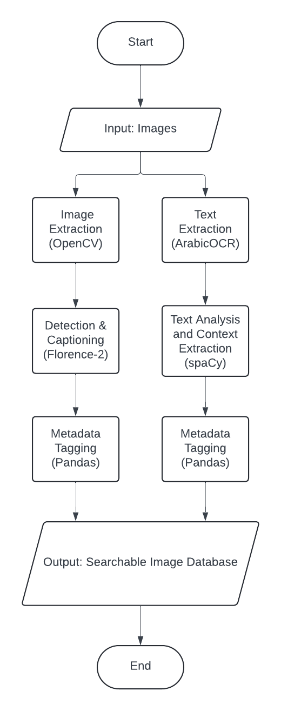
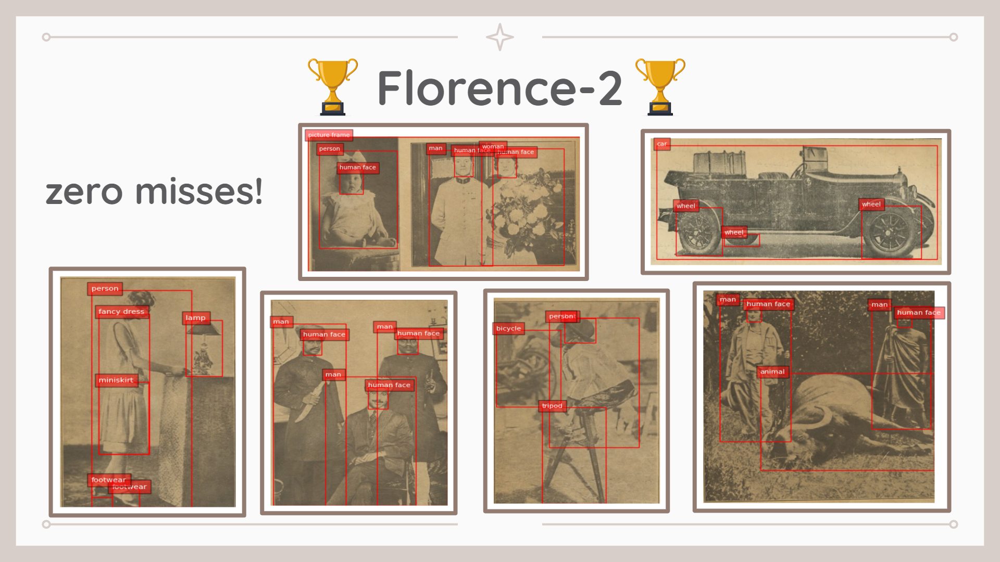
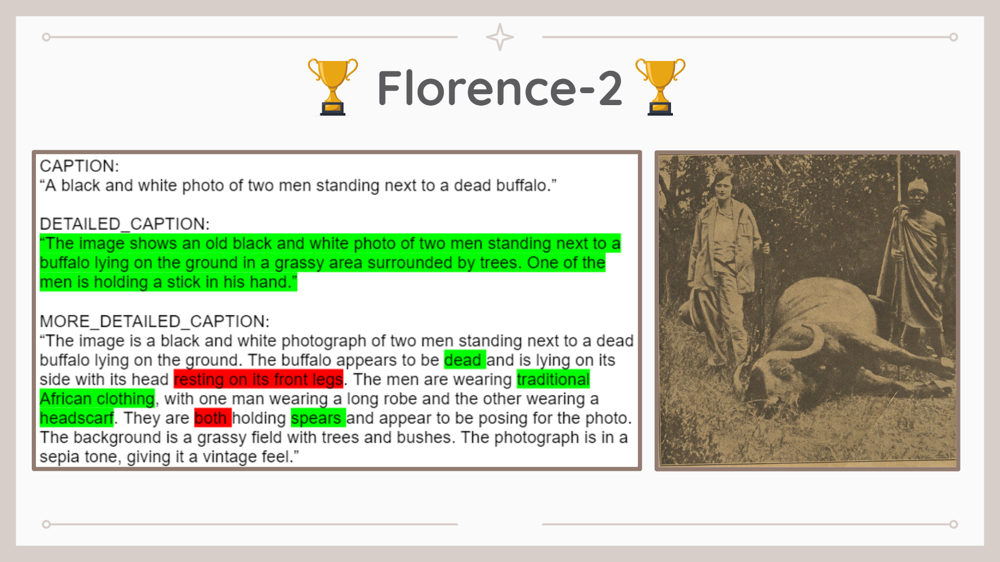
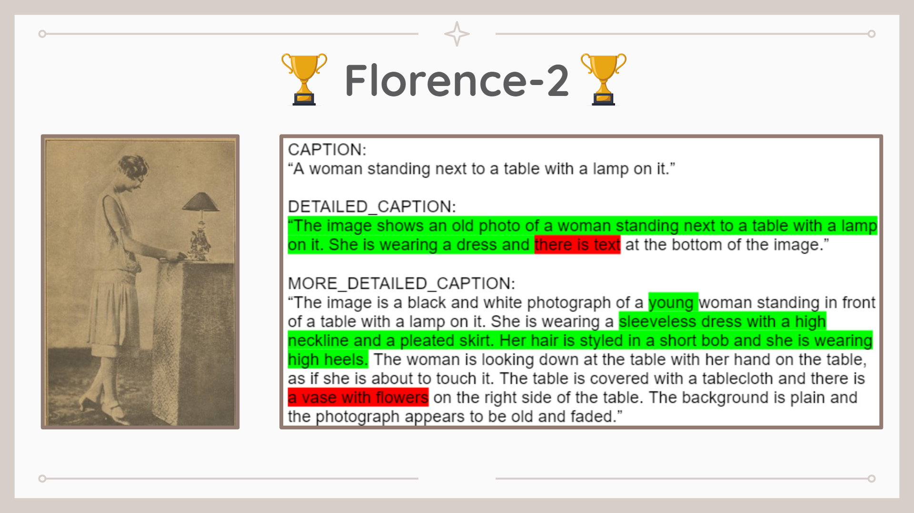
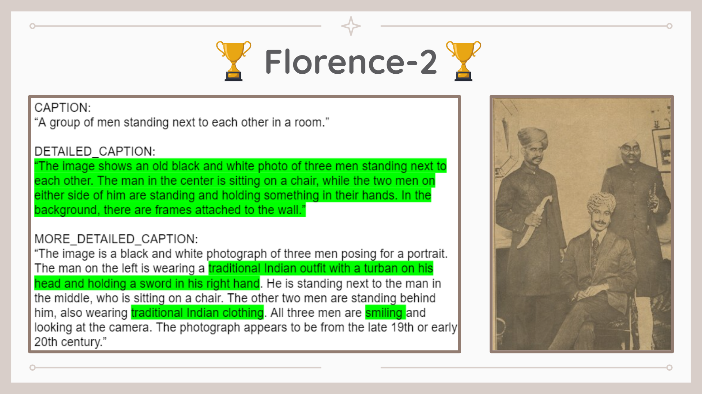
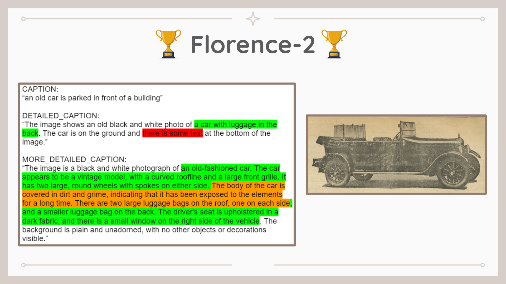

# Computer Vision and Image Tagging

## Author:
- Kirolous Fouty, Kirolous_Fouty@aucegypt.edu

## Supervisors (at AUC Libraries and Learning Technologies):
- Mr. Mark Muehlhaeusler, mark.muehlhaeusler@aucegypt.edu
- Ms. Irina Schmid, irina.schmid@aucegypt.edu
- Mr. Mohamed Khalil, m_khalil@aucegypt.edu
- Mr. Usama Salama, usama.s@aucegypt.edu

## Description:
- Computer Vision and Image Tagging project. Streamlining the process of extracting images from documents, extracting separate entities from each image, and tagging each, separately, with relevant metadata, specifically focusing on handling Arabic text. The solution combines several open-source tools for image processing, text extraction, object detection, and natural language processing (NLP). Creating a searchable database of images classified by hierarchically ordered categories relevant to the geographic and cultural context of the AUC Libraries' digital collections.

## Challenges faced:
- YOLO is trained on RGB images while our project processes greyscale images.
- flash-attn library requires specific GPUs to run, which weren't available for us locally. We used Google Colab instead. FlashAttention-2 currently supports: Ampere, Ada, or Hopper GPUs (e.g., A100, RTX 3090, RTX 4090, H100). Support for Turing GPUs (T4, RTX 2080) is coming soon, please use FlashAttention 1.x for Turing GPUs for now. Datatype fp16 and bf16 (bf16 requires Ampere, Ada, or Hopper GPUs). Source: https://github.com/Dao-AILab/flash-attention

## Timeline and Checkpoints Presentations:
- https://docs.google.com/presentation/d/1giwjIPuM9MFN2U88j5TvyCW0i-Jx5uJYc2Vqrxskfyo/edit?usp=sharing

## Tools used:
- Used Colab, GitHub, Web Scraping, OpenCV, Gemini API, Tesseract OCR, Keras, YOLO, InceptionV3, DenseNet-201, Pix2Pix, DeOldify, VGG16, ResNet, Florence-2, PyQt.

## Flowchart:

## Examples and Results:

